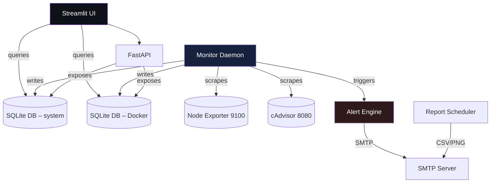

# Aigents Pulse v3.1 (Spectre+)  
**Infrastructure Observability Platform** – monitoring of system‑ level metrics (Node Exporter) **and** Docker container metrics (cAdvisor) with a Streamlit UI, REST API, alerting and scheduled reports.

---

## 📚 Table of Contents  

1. [Key Features](#-key-features)  
2. [Architecture overview](#-architecture-overview)  
3. [Prerequisites](#-prerequisites)  
4. [Installation & Setup](#-installation--setup)  
   - 4.1. [Clone the repository](#41-clone-the-repository)  
   - 4.2. [Python environment (virtualenv)](#42-python‑environment‑virtualenv)  
   - 4.3. [Generate encryption key & .env file](#43-generate‑encryption‑key‑and‑env)  
   - 4.4. [Install agents on **each** VPS client](#44-install-agents-on-each-vps-client)  
   - 4.5. [Run the application (Streamlit UI + optional API)](#45-run-the-application)  
5. [Configuration reference](#-configuration-reference)  
6. [Adding / removing VPS nodes](#-adding--removing-vps-nodes)  
7. [Troubleshooting & FAQ](#-troubleshooting--faq)  
8. [Contributing](#-contributing)  
9. [License](#-license)  

---  

## 🚀 Key Features  

| Feature | Description |
|---------|-------------|
| **Real‑time system metrics** (CPU %, RAM %, Disk %, latency) via **Node Exporter** (port 9100) |
| **Docker container metrics** (CPU %, memory MB, status) via **cAdvisor** (port 8080) |
| **Dual UI themes** – *Infinity* (dark) & *Daywalker* (light) with glass‑morphism CSS |
| **Alert engine** – UP → DOWN transition triggers an e‑mail with a 24‑hour PNG graph |
| **Scheduled reports** – weekly & monthly CSV + PNG sent by e‑mail (APScheduler) |
| **SQLite + WAL** for durable, low‑overhead persistence (system & Docker DBs) |
| **REST API** (`FastAPI`) – list VPS, latest status, metric history |
| **Credential encryption** – Fernet (AES‑256) with master key stored in `.env` |
| **Systemd service** – optional `aigents-pulse.service` for production‑grade startup |
| **Auto-Healing** | Automatically detects and removes corrupt metrics (CPU > 100%, 1.6TB RAM bugs) |
| **Robust Regex Scraper** | Advanced parsing logic to handle cAdvisor inconsistencies and edge cases |
| **Altair Analytics** | Interactive charts with forced 0-100% Y-axis scaling for accurate capacity planning |
---  

## 🏗️ Architecture overview  



*The UI, API and monitor daemon run over the same Python virtual‑env; Docker is only required on the client VPS (cAdvisor container).*

---  

## 📦 Prerequisites  

| Item | Minimum version / notes |
|------|--------------------------|
| **OS** | Ubuntu 20.04 LTS / 22.04 LTS or Debian 11/12 (other distros may work) |
| **Python** | **3.12** (mandatory – all wheels in `requirements.txt` are built for 3.12+) |
| **Docker Engine** | ≥ 24 .x on **each** client VPS (required for cAdvisor) |
| **System packages** | `ca-certificates`, `curl`, `gnupg`, `lsb-release`, `ufw` (optional) |
| **Network** | Server must be able to reach each VPS on TCP 9100 and 8080 |
| **Root / sudo** | **All installation steps that modify the OS (apt, systemd, Docker, firewall) must be run as *root***. The installer `install.sh` aborts if it detects a non‑root user. |

---  

## 🛠️ Installation & Setup  

### 4.1 Clone the repository  

```bash
git clone -b Spectre <REPOSITORIO_URL>
cd Aigentss-Pulse
```

### 4.2 Python environment (virtualenv)  

```bash
# 1️⃣ Create a virtual environment
python3.12 -m venv .venv

# 2️⃣ Activate it
source .venv/bin/activate   # <‑‑ every subsequent command must be run inside the venv

# 3️⃣ Install Python dependencies
pip install --upgrade pip
pip install -r requirements.txt
```

> **Tip:** If you get “cannot find `pip`” or similar, make sure you really are using Python 3.12 (`python3.12 --version`).  

### 4.3 Generate encryption key & `.env` file  

```bash
# Generate Fernet master key (base64‑encoded)
python3 -c "from cryptography.fernet import Fernet; print(Fernet.generate_key().decode())"
```

Copy the printed string into a new file called `.env` (you can start from the provided `.env.example`):

```ini
# .env
FERNET_KEY=TU_CLAVE_GENERADA_AQUI

# SMTP configuration (encrypted credentials – see docs on how to encrypt them)
SMTP_SERVER=smtp.gmail.com
SMTP_PORT=587
SMTP_USER_ENC= <base64‑encrypted user>
SMTP_PASS_ENC= <base64‑encrypted pass>
ALERT_EMAIL=tu_email@dominio.com
```

> **How to encrypt credentials** – run the following once (inside the venv) after `FERNET_KEY` is set in the environment:  

```bash
export FERNET_KEY=$(cat .env | grep FERNET_KEY | cut -d'=' -f2)
python - <<'PY'
import os, sys
from cryptography.fernet import Fernet
key = os.getenv("FERNET_KEY").encode()
c = Fernet(key)
plain = input("Enter plaintext credential: ").strip()
print(c.encrypt(plain.encode()).decode())
PY
```

Paste the resulting ciphertext into `SMTP_USER_ENC` and `SMTP_PASS_ENC`.

### 4.4 Install agents on **each** VPS client  

> **⚠️ VERY IMPORTANT:** The installer **must be executed with root privileges** (`sudo`).  
> If you run it as a normal user the script will stop with the message:  

```
⚠️  ERROR: Este script necesita privilegios de root.
Ejecuta: sudo ./install.sh   o   cambia a la cuenta root antes de iniciar.
```

#### 4.4.1 Copy the installer to the target VPS  

```bash
scp install.sh usuario@<IP_VPS>:/tmp/
# Instalación de métricas de Sistema y Docker
sudo bash install.sh

# Instalación de auditoría de Seguridad (Opcional)
sudo bash install_security.sh
```

#### 4.4.2 Run the installer as root  

```bash
ssh usuario@<IP_VPS>
sudo bash /tmp/install.sh
```

The script will:

1. Update apt repositories.  
2. Install Docker Engine (if missing) and start the daemon.  
3. Run a quick `docker run --rm hello-world` test.  
4. Install **Node Exporter** as a systemd service (listening on 9100).  
5. Pull and start **cAdvisor** container (listening on 8080).  
6. Open ports 9100 and 8080 through `ufw` (if present).  
7. Print a concise summary with the endpoints and next steps.

> **If you prefer a manual approach**, see the file `instrucciones.md` (or the “Installation manual” section in this README) for step‑by‑step commands.

#### 4.4.3 Verify the agents  

```bash
# System metrics
curl -s http://localhost:9100/metrics | head -n 5

# Docker metrics
curl -s http://localhost:8080/metrics | head -n 5

# Docker daemon health
docker ps -a | head -n 5
```

All three commands must return data without errors. If any command fails, consult the **Troubleshooting** section below.

### 4.5 Run the application (Streamlit UI + optional API)

```bash
# Ensure the virtualenv is active
source .venv/bin/activate

# Start Streamlit UI (default port 8501)
streamlit run app.py --server.port 8501 --server.address 0.0.0.0
```

Open a browser pointing to `http://<IP_DEL_SERVIDOR>:8501`.  
You should see the **Aigents Pulse** dashboard; the *Monitor Daemon* will start automatically (see `monitor.py`).

#### 4.5.1 Optional: Run the REST API  

```bash
python api.py    # will start FastAPI on port 8000
# or, in production, use uvicorn:
uvicorn api:app --host 0.0.0.0 --port 8000
```

API endpoints are documented at `http://<IP>:8000/docs`.

---  

## ⚙️ Configuration reference  

| Variable / DB key | Where it lives | Default / Example | Description |
|-------------------|----------------|-------------------|-------------|
| `monitoring_interval` (DB key) | `aigents_pulse.db` (table `config`) | `60` (seconds) | Scrape interval. Updated via UI or `db.set_config()`. |
| `ui_theme` (DB key) | `config` table | `Infinity` | UI theme (`Infinity` = dark, `Daywalker` = light). |
| `FERNET_KEY` | **.env** (environment) | `bXlfc2VjcmV0X2tleQ==` | Master key for encrypt/decrypt of SMTP credentials. |
| `SMTP_SERVER`, `SMTP_PORT`, `SMTP_USER_ENC`, `SMTP_PASS_ENC`, `ALERT_EMAIL` | **.env** | see above | SMTP configuration for alerts & reports. |
| `alerts.enabled` (config.yaml) | `config.yaml` | `true` | Master switch for the alert engine. |
| `reports.weekly_enabled`, `reports.monthly_enabled` | `config.yaml` | `true` | Enable scheduled reports. |
| `vps_list` (config.yaml) | `config.yaml` | `[]` | Optional static inventory; UI can also manage it. |

> **NOTE:** When you modify the DB directly (e.g., via `sqlite3`), use the schema defined in `db.py`. The UI will automatically reflect changes after a page refresh.

---  

## 📦 Adding / Removing VPS nodes  

### From the UI  

1. Open **Nucleus Config** tab.  
2. **Add New VPS** – fill IP, friendly name, ports (9100/8080) and click *Save*.  
3. Toggle the **Active** checkbox to enable/disable monitoring.  
4. To delete a node, click the trash‑can icon next to it.

### From the CLI (optional)  

```bash
# Inside the virtualenv
python - <<'PY'
import db
# Add
db.add_vps('10.0.0.12', 'web-prod-01', 9100, 8080)
# Remove
db.remove_vps('10.0.0.12')
PY
```

---  

## 🛠️ Troubleshooting & FAQ  

| Symptom | Likely cause | Diagnostic / Fix |
|---------|--------------|-------------------|
| **`failed to connect to the docker API … no such file or directory`** | Docker daemon not running, or socket missing. | ```bash sudo systemctl status docker``` – if inactive: `sudo systemctl start docker`. Verify socket: `ls -l /var/run/docker.sock`. |
| **Permission denied when running `docker run …`** | User not in `docker` group. | ```bash sudo usermod -aG docker $USER && newgrp docker``` (or just keep using `sudo`). |
| **Node Exporter returns 404 or empty response** | Service stopped or firewall blocks 9100. | ```bash sudo systemctl status node_exporter``` – restart if needed. Check firewall: `sudo ufw status | grep 9100`. |
| **cAdvisor endpoint returns HTML/404** | Container stopped, wrong port, or missing privileges. | ```bash sudo docker ps -a | grep cadvisor``` – if `Exited`, run `sudo docker start cadvisor`. Verify port: `netstat -tnlp | grep 8080`. |
| **Ports 9100/8080 not reachable from central server** | Host firewall (ufw, firewalld) or cloud security group. | Open ports: `sudo ufw allow 9100/tcp && sudo ufw allow 8080/tcp`. In cloud providers, edit the security‑group / network ACL to allow these ports from the central IP. |
| **Alert e‑mail never arrives** | SMTP credentials not encrypted correctly or `FERNET_KEY` missing. | Ensure `.env` contains `FERNET_KEY` and the encrypted `SMTP_USER_ENC` / `SMTP_PASS_ENC`. Test: `python -c "import notification, os; print(notification.send_alert('1.2.3.4','test', b'fakepng')"`. |
| **UI shows “No VPS configured”** | No nodes have been added, or the DB file is corrupted. | Add a VPS via UI (Nucleus Config) or via `db.add_vps()`. Verify DB contains rows: `sqlite3 aigents_pulse.db "SELECT * FROM vps_inventory;"`. |
| **Scheduler does not send weekly report** | `reports.weekly_enabled` is `false` or the APScheduler process died. | Check logs (`journalctl -u aigents-pulse -f` or Streamlit console). Ensure the daemon `monitor.py` called `report.init_scheduler()` (it does on daemon start). |
| **`install.sh` aborts with “run as root”** | Script executed without `sudo`. | Re‑run the command with `sudo ./install.sh` **or** become root (`sudo -i`) before invoking it. |

### Quick “docker‑socket” sanity check (run on every client VPS)

```bash
if [[ ! -S /var/run/docker.sock ]]; then
    echo "❌ Docker socket missing – daemon not running"
    sudo systemctl restart docker
else
    echo "✅ Docker socket present"
fi
```

---  

## 🤝 Contributing  

1. Fork the repository.  
2. Create a feature branch (`git checkout -b feat/awesome-feature`).  
3. Run tests (if any) with `pytest`.  
4. Keep the code style consistent with `black`/`flake8`.  
5. Submit a Pull Request with a clear description of the change.  

> **Note:** The UI heavily relies on Streamlit 1.35+, and the Python version must stay at 3.12 until the next major release.

---  

## 📄 License  

```
Privado - Aigents Pulse v3.0
© 2026 Aigents Solutions. Todos los derechos reservados.
```

---  

*Prepared by **Ing. Ángel David Yaguana**, Dr. h.c. – CAIO & CIO | **Aigents Solutions** – Version 3.1.0 (Spectre+)*  